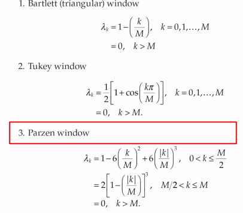

# Spectral Density
```{r, include =F}
library(quantmod)
options("getSymbols.warning4.0" = F)
```
A tool to identify the frequency content of a (stationary) time series.

## Derivation of spectral density of white noise

$$S_x(f) = 1+2 \sum_{k = 1}^\infty \rho_k \mathrm{cos}\left( 2 \pi f k\right), \mid f \mid = 0.5$$

For white noise, $\rho_0 = 1$, if $k \neq 0$, $\rho_k = 0$

This tells us that for white noise:

$$ S_x(f) = 1 + 2*0 = 1$$
In other words: **All frequencies are equally present in white noise**

## Estimating Spectral Density from Real Data

With real data, we don't have an infinite amount, and we do not know what the true autocorrelation is. So we are probably going to have to make some estimates.

Lets first estimate autocorrelation:

$$S_x(f) = 1+2 \sum_{k = 1}^\infty \widehat{\rho_k} \mathrm{cos}\left( 2 \pi f k\right), \mid f \mid = 0.5$$
Now lets deal with the infinity, which is killing us. We know that:
$$\hat\rho_1 = \frac { \frac{1}{n} \sum_{t=1}^n-1 (X_t - \bar{X})(X_{t+1} - \bar{X}) }{\hat\gamma_0}$$
And (check yourself to see the math works)

$$\hat\rho_{n-1} = (X_1 - \bar X)(X_n - \bar(x)) /(n\hat\gamma_0)$$

We can then rewrite the sample spectral density/sample spectrum as!:
$$S_x(f) = 1+2 \sum_{k = 1}^{n-1} \widehat{\rho_k} \mathrm{cos}\left( 2 \pi f k\right), \mid f \mid = 0.5$$
However, this estimate of autocorrelation cannot be very good, since it is estimated using one cross product/pair. Thats like estimating the mean with one value!

So, lets stop this sum somewhere more reasonable.

$$\widehat{S_x(f)} = 1+2 \sum_{k = 1}^{M} \widehat{\rho_k} \mathrm{cos}\left( 2 \pi f k\right), \mid f \mid = 0.5$$

Where M is less than $n-1$. This lets us have a bit more freedom to decide what M should be.

Let us now rewrite the estimate of spectral density as:
$$\widehat{S_x(f)} = \lambda_0 1+2 \sum_{k = 1}^{M} \lambda_k\widehat{\rho_k} \mathrm{cos}\left( 2 \pi f k\right), \mid f \mid = 0.5$$
Where $\mid\lambda_k \mid$ decreases as k increases. With this, we have M minimizing and limiting the impact of sample autocorrelations when k gets pretty close to n, and lambda further decreases the impact of the poor sample autocorrelations at high values of k. These are called ***window functions***. In our case, we will use what is called the Parzen window. Other windows (every statistician in the 60's had their own window) include: the Tukey window, the Bartlett window, etc. We call this the the smooth spectral density estimator. $M$ is frequently chosen to be $2 \sqrt n$

## Spectral Density in the Wild

First, lets look at a simple example:

```{r, results = 'hide', fig.show = 'hold'}
x <- 1:1000
y  <- sin(x)
par(mfrow = c(2,1))
curve(sin(x), 1,1000)
parzen.wge(y)
```

Shockingly, we have a frequency peak at roughly $\frac{1}{2 \pi} = `r 1/(2*pi)`$. If I did a better job of generating the data, it would be a super shark peak and nothing else, however I did not. Lets look at sunspot data now:

```{r, results = 'hide', fig.show = 'hold'}
par(mfrow = c(1,1))
data(sunspot.classic)
tplot(sunspot.classic) + ggthemes::theme_few()
parzen.wge(sunspot.classic)
```

It looks like we have a frequency peak at about 0.1, which makes sense because the classic sunspot psuedoperiod is about 11 years. Lets look at some aperiodic stock data now:

```{r, results = 'hide', fig.show = 'hold'}
getSymbols("GOOG", src = "yahoo")
plot(GOOG[, "GOOG.Close"])
parzen.wge(GOOG$GOOG.Close)
```

Sadly, there appears to be no real periodicity in google's stock price, no free money for us :(. The peak at 0 means that the data is either aperiodic or it has not been long enough to show a period.

## Why do we do spectral density from -0.5 to 0.5?

Time series data is taken in integers. What is the shortest distance between two integeres that we can complete a period in? It is 2. This means the highest obesrvable frequency is 0.5. Interestingly, if you look at sin(2pi.3t) and sin(2pi1.3t) at the integers, we will have exactly the same value. This means that even if the frequency is higher, we will have it be aliased to be exactly the same as the lower frequency function:

```{r}
x <- 0:100
y1 <- sin(2*pi*.3*x)
y2 <- sin(2*pi*1.3*x)
round(y2-y1,2)
```

This is called ***aliasing***. These two functions will have the same spectral densities. 0.5 is known as the ***Nyquist Frequency***

```{r}

```

A note on plots of spectral density: Normally we do this in a logarithmic scale, so we can see whats going on.
